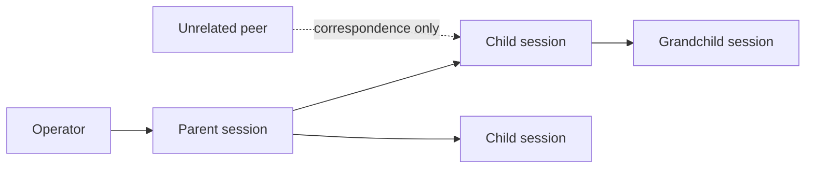

# Agency

**Give agents authority over their terminal—without giving every agent authority.**

Agency is an independent Apache-2.0 product that pairs with Gossip. Gossip lets independently
launched sessions discover, observe, search, and communicate. Agency launches a session inside an
owned PTY and lets it issue local slash commands to itself and to descendants it spawned.

The separate repository and release boundary are intentional. Terminal input is materially more
privileged and more platform-specific than correspondence.

## The custody rule

A supervised session may act on itself, a child it spawned, or a deeper descendant reached through
the recorded custody chain. Knowing a session id is not custody. Receiving a Gossip message is not
custody. A peer cannot turn its message body into operator input.

## What Agency exposes

- Flashback-assisted self-compaction and focused compaction;
- model, effort, fast-mode, and plan-mode changes;
- status, usage, task, identity, and skill-reload controls;
- clean self-exit;
- other harness slash commands under a launch-time policy;
- supervised child creation and descendant command requests;
- an inspectable custody ledger and literal injection receipts.

The `context` policy exposes context and usage commands. `self-manage` adds model, effort, mode,
identity, skill reload, and exit. An explicit `all-slash` policy exposes the full local command
surface. These profiles live in a user-editable JSON file with `allow` and `deny` lists; deny wins.
`/model*` permits `/model` with any arguments without maintaining a model catalogue. Arbitrary prose
remains excluded because it would be indistinguishable from the operator typing a prompt.

## Gossip + Flashback + Agency

| Product | Question it answers | Power it does not inherit |
|---|---|---|
| Gossip | Who is there, what are they doing, and what was said? | Context admission or terminal input |
| Flashback | What small context belongs here now, and is it still valid? | Permission to act |
| Agency | Who may command this terminal? | Work scheduling or ambient peer trust |

Flashback is more than continuity. It supplies safe just-in-time context, can address records to a
phase or lifecycle hook, and re-checks facts that survive compaction. Agency lets the session pull
the compaction lever or change another runtime control. The combination is powerful because the
responsibilities remain separate: context relevance never becomes authorization.

## Agency, Claude Code, and Outsourcerer

| Question | Claude Code agent teams | Outsourcerer | Agency |
|---|---|---|---|
| Main primitive | Team tasks and peer messages | Managed work dispatch | Terminal custody |
| Self slash commands through the messaging layer | No | Not the product focus | **Yes** |
| Spawned-session control | Team coordination and shutdown requests | Managed jobs | **PTY descendants** |
| Chooses models, retries, worktrees, and budgets | Shared tasks; not a general scheduler | **Yes** | No |
| Unrelated-peer terminal authority | No | Controller-owned jobs | **No** |
| Literal command transport receipts | Native team behavior | Job lifecycle | **Queued / refused / injected** |

[Claude Code agent teams](https://code.claude.com/docs/en/agent-teams) are a native Claude
collaboration mode. [Outsourcerer](https://github.com/alexgreensh/outsourcerer) is an orchestration
decision layer. Agency is the small custody substrate underneath or beside either system.

tmux is another compatible substrate, not a substitute. Its `send-keys` command can place raw input
in a pane, while Agency records who requested a command, whether custody permits the target, which
launch policy applies, and whether the target supervisor queued, refused, or injected it. Gossip
messages remain correspondence; knowing a pane or agent address never grants Agency authority.

## Security invariant

Gossip correspondence and Agency command input never meet automatically. To act on a peer
suggestion, the recipient must independently decide to submit an Agency request, and the target
must accept it under custody and launch-time policy. Sending text never grants operator authority.

The standalone source currently lives at `D:\agency`; publish its public URL here when the new
repository is created.
